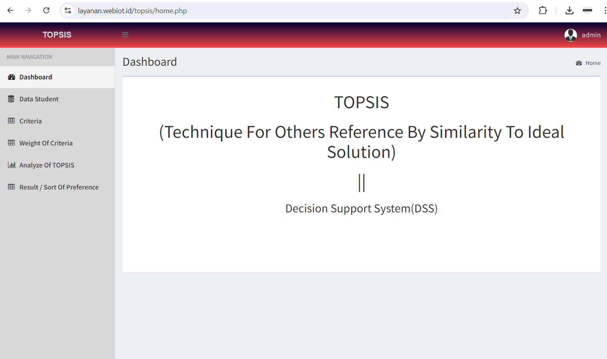
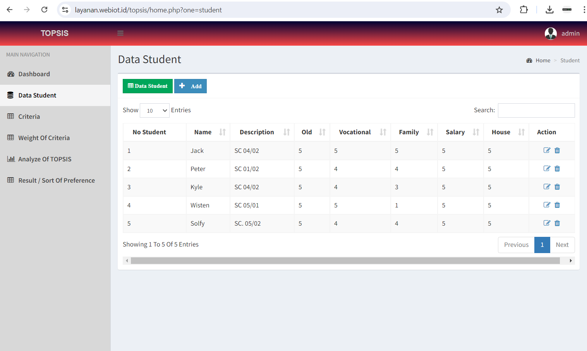
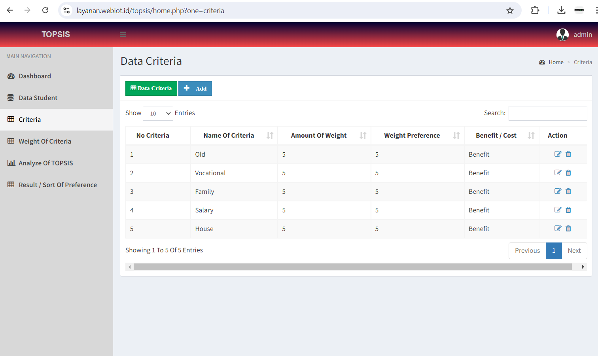
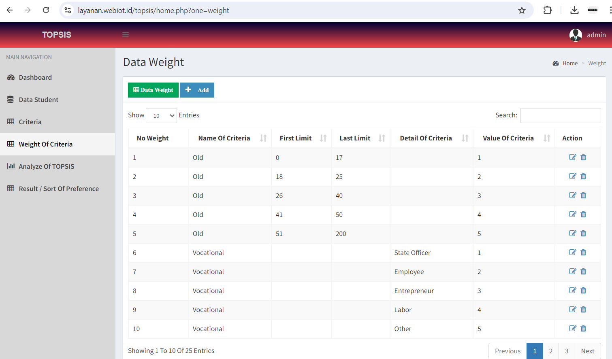
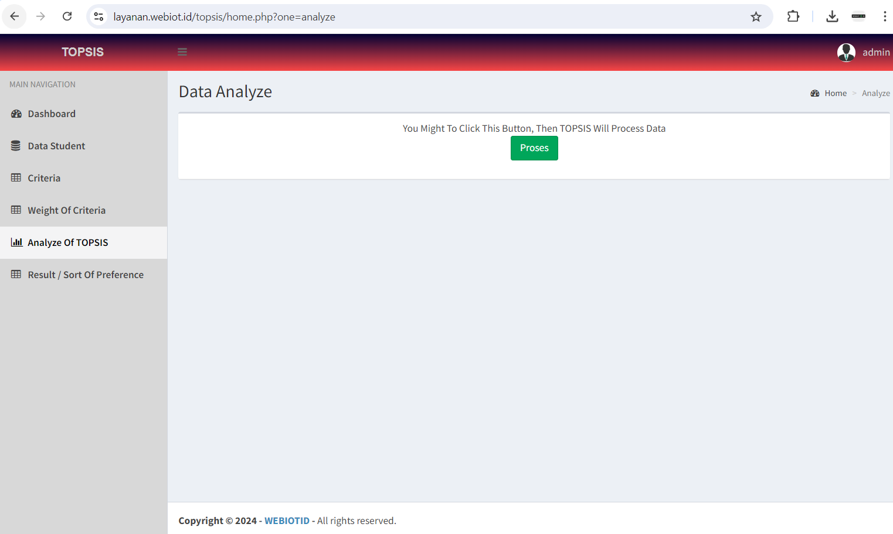
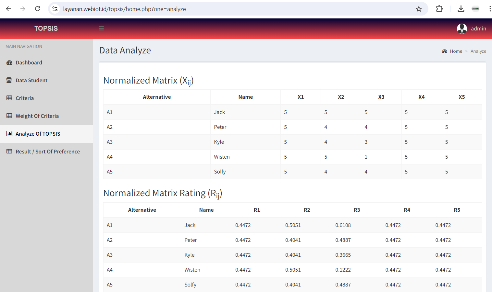
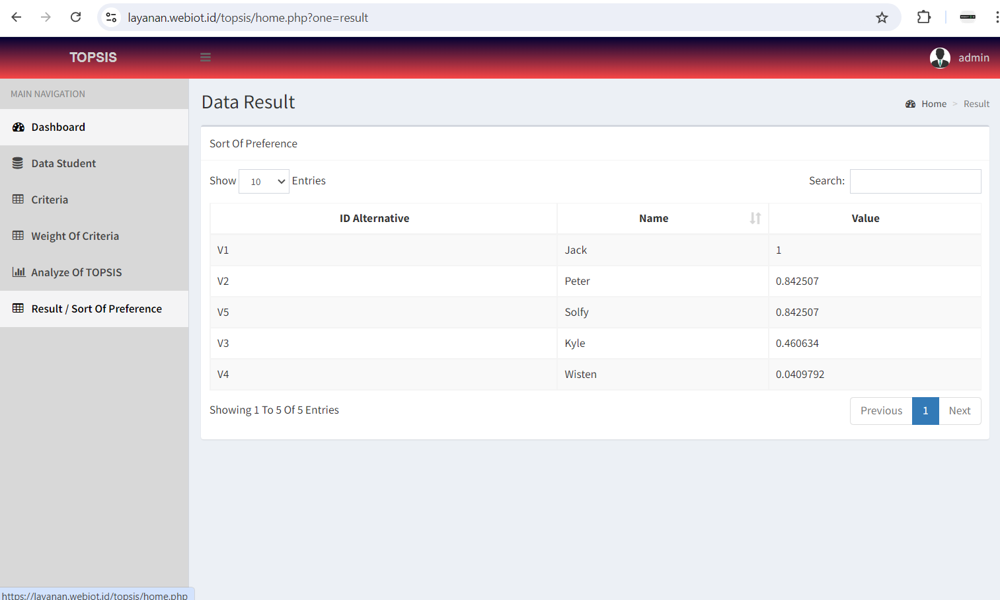

### WEBIOTID: Metode TOPSIS (Technique for Order of Preference by Similarity to Ideal Solution)

---

**TOPSIS** adalah metode pengambilan keputusan (SPK) multi-kriteria yang digunakan untuk menentukan peringkat alternatif berdasarkan jarak mereka dari solusi ideal positif dan solusi ideal negatif. Metode ini berguna dalam situasi di mana ada beberapa kriteria yang perlu dipertimbangkan untuk membuat keputusan yang optimal.

---

**Langkah-Langkah TOPSIS**

1. **Membangun Matriks Keputusan**
- Matriks keputusan berisi alternatif (A1, A2, ..., An) dan kriteria (C1, C2, ..., Cm).
- Matriks ini dinyatakan sebagai \($X = [x_{ij}]$\) dengan \($x_{ij}$\) adalah nilai kinerja alternatif \($A_i$\) pada kriteria \($C_j$\).

2. **Normalisasi Matriks Keputusan**
- Normalisasi dilakukan untuk mengubah berbagai skala kriteria menjadi skala yang sama.
- Rumus normalisasi:

$$
r_{ij} = \frac{x_{ij}}{\sqrt{\sum_{i=1}^{n} x_{ij}^2}}
$$

3. **Membangun Matriks Keputusan Ternormalisasi Terbobot**
- Matriks ini diperoleh dengan mengalikan setiap elemen matriks normalisasi dengan bobot kriteria yang sesuai.
- Rumusnya:

$$
v_{ij} = w_j \cdot r_{ij}
$$

- di mana \($w_j$\) adalah bobot kriteria \($C_j$\).

4. **Menentukan Solusi Ideal Positif \($A$\*\) dan Solusi Ideal Negatif \($A^-$\)**
- Solusi ideal positif \($A$\*\) mencakup nilai terbaik untuk setiap kriteria: $$A^{*} = \{v_1^{*}, v_2^{*}, ..., v_m^{*}\} 
= \left\lbrace\max(v_{ij}) \text{ untuk } kriteria \text{ benefit}, \min(v_{ij}) \text{ untuk } kriteria \text{ cost}\right\rbrace$$

- Solusi ideal negatif \($A^-$\) mencakup nilai terburuk untuk setiap kriteria: $$A^- = \{v_1^-, v_2^-, ..., v_m^-\} 
= \left\lbrace\min(v_{ij}) \text{ untuk } kriteria \text{ benefit}, \max(v_{ij}) \text{ untuk } kriteria \text{ cost}\right\rbrace$$

5. **Menghitung Jarak dari Solusi Ideal Positif dan Negatif**
- Jarak dari solusi ideal positif:

$$
D_i^* = \sqrt{\sum_{j=1}^{m} (v_{ij} - v_j^*)^2}
$$

- Jarak dari solusi ideal negatif:

$$
D_i^- = \sqrt{\sum_{j=1}^{m} (v_{ij} - v_j^-)^2}
$$

6. **Menghitung Nilai Preferensi untuk Setiap Alternatif**
- Nilai preferensi untuk setiap alternatif dihitung menggunakan formula:

$$C_i^* = \frac{D_i^-}{D_i^- + D_i^*}$$

- Nilai \($C_i$\*\) berkisar antara 0 dan 1. Alternatif dengan nilai \($C_i$\*\) terbesar adalah yang terbaik.

---

**Contoh Kasus**

Misalkan kita memiliki tiga alternatif (A1, A2, A3) dan tiga kriteria (C1, C2, C3). Bobot kriteria adalah w = [0.5, 0.3, 0.2]. Matriks keputusan awal adalah sebagai berikut:

$$
\begin{array}{ccc}
    & C1 & C2 & C3 \\
A1 & 7 & 9 & 8 \\
A2 & 8 & 7 & 6 \\
A3 & 9 & 8 & 9 \\
\end{array}
$$

1. **Normalisasi Matriks Keputusan**

$$
R = \begin{array}{ccc}
0.502 & 0.545 & 0.577 \\
0.574 & 0.424 & 0.433 \\
0.645 & 0.485 & 0.650 \\
\end{array}
$$

2. **Normalisasi Matriks Keputusan Terbobot**

$$
V = \begin{array}{ccc}
0.251 & 0.164 & 0.115 \\
0.287 & 0.127 & 0.087 \\
0.322 & 0.145 & 0.130 \\
\end{array}
$$

3. **Solusi Ideal Positif dan Negatif**

$$
A^* = \{0.322, 0.164, 0.130\} \quad A^- = \{0.251, 0.127, 0.087\}
$$

4. **Menghitung Jarak dari Solusi Ideal Positif dan Negatif**

$$
D_1^* = 0.081 \quad D_1^- = 0.072 \\
D_2^* = 0.063 \quad D_2^- = 0.064 \\
D_3^* = 0.042 \quad D_3^- = 0.092 \\
$$

5. **Nilai Preferensi**

$$
C_1^* = 0.471 \quad C_2^* = 0.504 \quad C_3^* = 0.686
$$

---

Dari perhitungan di atas, alternatif A3 adalah yang terbaik karena memiliki nilai preferensi tertinggi (0.686). #WEBIOTID #PakAR #TOPSIS #DecisionMaking #MultiCriteriaAnalysis #MachineLearning #DataScience #Optimization

WEBIOTID menyediakan aplikasi pemrograman metode TOPSIS dengan menggunakan bahasa pemrograman php native. contoh demo aplikasi dapat anda gunakan dengan mengunjungi [link ini](https://layanan.webiot.id/topsis/). Hubungi kami untuk mendapatkan full source code [aplikasi pemrograman metode TOPSIS](https://webiot.id/#payment)

